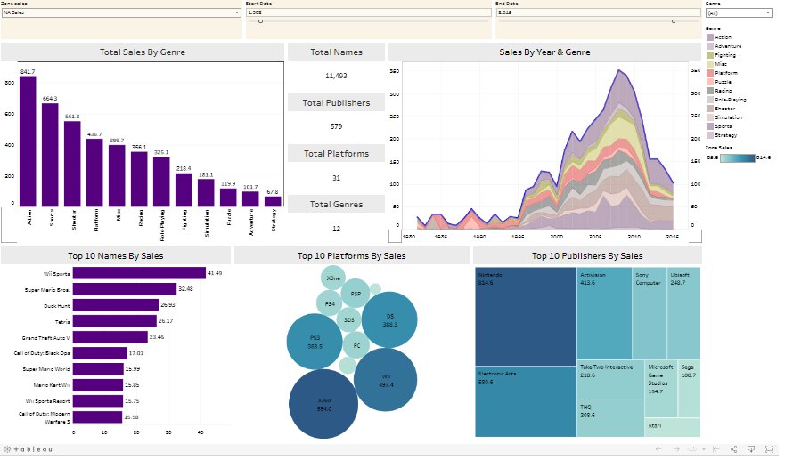

# Video Sales Visualization in Tableau
This project offers dynamic insights into video sales data using Tableau visualizations.

## Overview
Dynamic Filters: Interactive dropdown lists for regional sales, start/end dates.  
Visualizations: Explore total sales, trends by year, genre, top 10 performers.  
Insightful Dashboard: Integrated visuals for comprehensive sales analysis.  
## How to Use
Download: Access the Kaggle video sales dataset used in this project.  
Tableau: Open the project in Tableau to explore visualizations and insights.  
Filters: Use dropdown menus to delve into specific regional and date-based sales data.  
Dashboard: Navigate through the integrated dashboard for a holistic sales overview.  
## Dashboard

## Dataset Information
Source: [Kaggle Video Games Sales Dataset](https://www.kaggle.com/datasets/gregorut/videogamesales)  
Details: There are 16,598 records. 2 records were dropped due to incomplete information
## Technologies Used
Tableau
